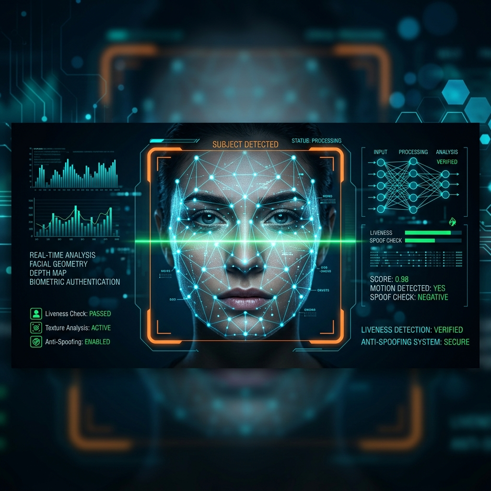
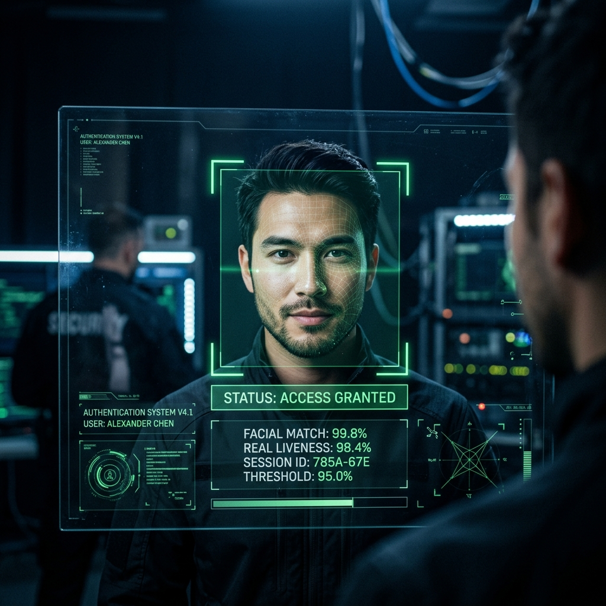
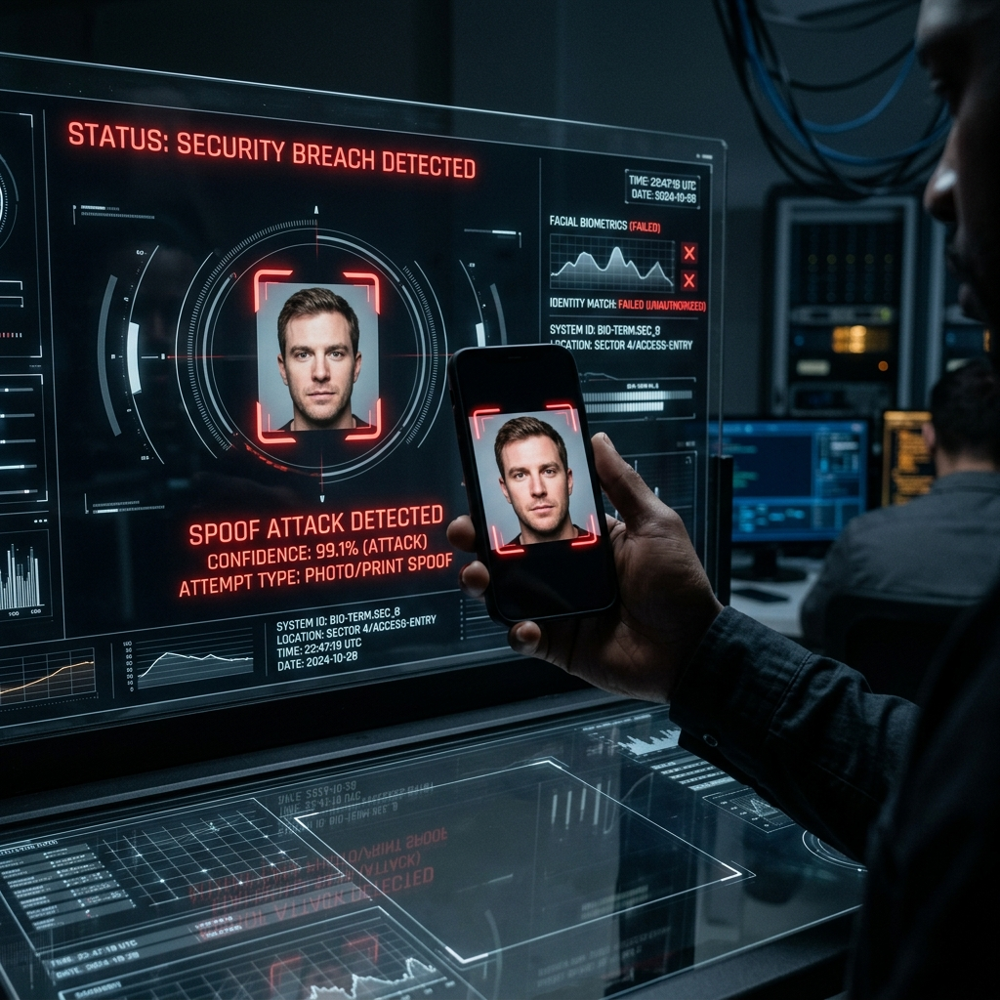

# 🛡️ Real-Time Face Liveness Detection & Biometric Anti-Spoofing System

[](https://www.python.org/)
[](https://scikit-learn.org/)
[](https://opencv.org/)
[](https://en.wikipedia.org/wiki/Biometric_anti-spoofing)
[](LICENSE)

An advanced, real-time biometric security system designed to prevent spoofing attacks (facial spoof attacks via mobile screens, high-definition printouts, or paper masks). Leveraging **Local Binary Patterns (LBP)** for texture-based feature extraction and an **RBF-Kernel Support Vector Machine (SVM)**, the system performs fast, localized, and highly accurate face liveness classification right at the edge.

---

<p align="center">
  
</p>

---

## 📋 Table of Contents

- [Key Features](#-key-features)
- [How It Works (TL;DR)](#-how-it-works-tldr)
- [System Architecture & Pipeline](#-system-architecture--pipeline)
- [Repository Structure](#-repository-structure)
- [Prerequisites](#-prerequisites)
- [Installation & Setup](#%EF%B8%8F-installation--setup)
- [Running the System](#-running-the-system)
- [Performance & Tweaking](#-performance--tweaking)
- [Diagnostics & Troubleshooting](#%EF%B8%8F-diagnostics--troubleshooting)
- [License & Contributions](#%EF%B8%8F-license--contributions)

---

## 🌟 Key Features

*   **🔒 High-Fidelity Anti-Spoofing**: Successfully detects and mitigates digital display spoofs (phones/tablets), high-resolution photo prints, and paper-mask attacks.
*   **⚡ Edge-Ready & Lightweight**: No heavy deep learning dependencies. LBP feature descriptors combined with optimized SVM classifiers run smoothly at 30+ FPS on consumer laptops and embedded devices.
*   **🎮 Cyberpunk HUD Biometric Interface**: Built-in immersive real-time testing GUI including:
    *   **Lock-on Bounding Boxes**: Smooth HUD target locking on faces.
    *   **Biometric Scan Mode**: A 3-second diagnostic phase displaying a moving laser-scan overlay.
    *   **Glassmorphism Panels**: Transparent black HUD overlays highlighting system status and real-time statistics.
    *   **Decision States**: Explicit bold visual feedback with green `ACCESS GRANTED` or red `SECURITY BREACH DETECTED`.
*   **🛠️ End-to-End Pipeline**: Includes automated Kaggle dataset download utilities, webcam-based custom dataset collectors for real/spoof classes, training pipelines, and evaluation diagnostics.

---

## 🧠 How It Works (TL;DR)

> **Real human skin** has unique micro-pore textures and light-reflection properties.  
> **Screens** exhibit Moiré patterns, pixel grids, and glass glare.  
> **Printed photos** show paper fiber patterns, flat reflections, and ink dispersion.

The system captures your face via webcam, extracts **Local Binary Pattern (LBP)** texture features from the facial region, and feeds them into a trained **SVM classifier** that determines — in under 100ms per frame — whether the face is _real_ or _spoofed_.

A **3-second temporal averaging** window smooths out frame-to-frame noise, yielding a final confidence score.

---

## 📊 System Architecture & Pipeline

The system operates on a multi-stage image processing and machine learning pipeline, running in real-time as follows:


### 🔬 Core Methodology

**1. Face Localization**

OpenCV's Haar Cascade finds the bounding box of the face, isolating the Region of Interest (ROI) and ignoring non-biometric background noise (walls, objects, etc.).

**2. Texture Analysis (LBP)**

Real skin reflects light smoothly and exhibits micro-pore textures. Screens suffer from *Moiré patterns*, bezel borders, pixelation, and glass reflections. Printed paper exhibits unique fibrous patterns, ink dispersion, and flat light reflections. The **Local Binary Pattern (LBP)** descriptor ( $Radius = 2, Points = 16$ ) computes a binary code for each pixel's neighborhood to identify these microscopic texture anomalies:

$$\text{LBP}_{P, R}(x_c, y_c) = \sum_{p=0}^{P-1} s(g_p - g_c) \cdot 2^p$$

where $g_c$ is the gray value of the center pixel, $g_p$ represents neighboring pixels, and $s(x)$ is the threshold sign function:

$$s(x) = \begin{cases} 1 & x \ge 0 \\\ 0 & x < 0 \end{cases}$$

**3. Histogram Binning**

The extracted uniform LBP patterns are compiled into a normalized $18$-bin feature vector, serving as a lighting-invariant signature of the facial surface.

**4. SVM Classification**

An RBF-kernel SVM maps the LBP features into a high-dimensional space where spoofing textures are highly separable from real skin:

$$K(\mathbf{x}, \mathbf{x}') = \exp\left(-\gamma \|\mathbf{x} - \mathbf{x}'\|^2\right)$$

---

## 📂 Repository Structure

```
Face-Anti-Spoofing/
├── assets/                      # High-quality graphics and system screenshots
│   ├── banner.png               # Repository cover banner
│   ├── scan_real.png            # GUI preview during Access Granted state
│   └── scan_spoof.png           # GUI preview during Spoof Attack Detected state
├── dataset_tools/               # Utilities for obtaining raw training data
│   └── download_dataset.py      # Fetches & structures Kaggle liveness data → Kaggle_dataset/
├── models/                      # Serialized binary models (git-ignored, created locally)
│   ├── liveness_scaler.pkl      # Trained StandardScaler object
│   └── liveness_svm_model.pkl   # Trained Support Vector Machine model
├── scripts/                     # Webcam collection helpers to expand the dataset
│   ├── add_custom_data.py       # Records 5,000 real + 5,000 screen-spoof webcam images → my_dataset/
│   └── add_paper_spoof.py       # Appends 3,000 paper-spoof webcam images → my_dataset/spoof/
├── testing/                     # Evaluation and live testing environment
│   └── realtime_tester.py       # Core biometric scanner terminal (webcam HUD GUI)
├── training/                    # Machine learning training script
│   └── train_model.py           # Trains model using LBP + SVM on my_dataset/ → models/
├── .gitignore                   # Excludes datasets, models, caches from version control
├── requirements.txt             # Pinned Python dependencies
└── README.md                    # This file
```

> **Generated at runtime** (git-ignored):
> - `my_dataset/real/` & `my_dataset/spoof/` — Custom webcam-captured training images
> - `Kaggle_dataset/real/` & `Kaggle_dataset/spoof/` — Downloaded Kaggle baseline images
> - `models/*.pkl` — Trained model artifacts

---

## 📝 Prerequisites

| Requirement | Details |
| :--- | :--- |
| **Python** | 3.8 or newer |
| **Webcam** | Built-in or USB camera (for live testing & data collection) |
| **OS** | Linux, macOS, or Windows |
| **Kaggle API** _(optional)_ | Only needed if using `download_dataset.py` to pull baseline data |

---

## ⚙️ Installation & Setup

### 1. Clone the Repository
```bash
git clone https://github.com/Ghanem-MO/Face-Anti-Spoofing.git
cd Face-Anti-Spoofing
```

### 2. Install Dependencies

**Option A** — Using `requirements.txt` (recommended):
```bash
pip install -r requirements.txt
```

**Option B** — Manual install:
```bash
pip install opencv-python numpy scikit-image scikit-learn joblib tqdm
```

> **Note**: If you plan to use the Kaggle dataset downloader, also install the Kaggle CLI:
> ```bash
> pip install kaggle
> ```

---

## 🚀 Running the System

You can run this project using pre-trained models, or build your own custom liveness classifier.

### Step A: Real-Time Verification (Immediate Test)
To launch the real-time biometric screening window immediately using the pre-packaged models (`models/` folder):
```bash
python testing/realtime_tester.py
```

| Key | Action |
| :---: | :--- |
| _— (auto)_ | System auto-locks onto detected faces |
| **`S`** / **`Space`** | Arm the scanner — initiates 3-second biometric scan |
| **`R`** | Reset — clear results and scan again |
| **`Q`** | Quit the application |

**Scan Flow:**
1. **Idle** — Stand in front of your camera. The system auto-locks onto your face with a yellow HUD box.
2. **Scanning** — Hold steady for **3 seconds** as the cyan laser sweeps your face.
3. **Result** — The system displays one of:
   - 🟢 **`ACCESS GRANTED`** — you are a real human, with your liveness probability.
   - 🔴 **`SECURITY BREACH DETECTED`** — a screen or printout was detected, with spoof probability.

---

<div align="center">
  <table width="100%">
    <tr>
      <td width="50%" align="center">
        <b>🟢 Access Granted (Real Face)</b><br>
        <br>
        <i>High liveness score, smooth organic skin reflections.</i>
      </td>
      <td width="50%" align="center">
        <b>🔴 Security Breach (Spoof Attack)</b><br>
        <br>
        <i>Flagged spoof screen due to pixel grids & high reflections.</i>
      </td>
    </tr>
  </table>
</div>

---

### Step B: Build/Retrain Your Own Custom Model

If you'd like to train the system to identify your own face, custom environments, or specific spoof attacks:

#### 1. Download Baseline Dataset (Optional)
To pull down a base dataset of 10,000+ real and spoof images from Kaggle:
> **Note**: Ensure you have your `kaggle.json` API token configured. See [Kaggle API docs](https://github.com/Kaggle/kaggle-api#api-credentials) for setup instructions.
```bash
python dataset_tools/download_dataset.py
```
This downloads and organizes images into `Kaggle_dataset/real/` and `Kaggle_dataset/spoof/`.

#### 2. Capture Custom Webcam Data (Recommended)
Tailor the model to your environment by collecting custom real and screen-spoof webcam images:
```bash
python scripts/add_custom_data.py
```
*   Press **`[R]`** to capture **5,000 frames** of your real face (rotate your head, change expressions, adjust lighting).
*   Press **`[S]`** to capture **5,000 frames** of spoof attempts (hold up a smartphone displaying photos or playing videos of your face).

Images are saved to `my_dataset/real/` and `my_dataset/spoof/`.

#### 3. Append Paper Spoof Data
Enhance protection against printouts by capturing printed physical photos of your face:
```bash
python scripts/add_paper_spoof.py
```
*   Press **`[P]`** to capture **3,000 frames** of printed photos (bend the paper slightly, vary distances, catch reflections).

Images are appended to `my_dataset/spoof/` with unique timestamped filenames (no overwrites).

#### 4. Run Model Training
Process all raw images in `my_dataset/`, extract face ROIs, compute LBP feature vectors, and fit the RBF-Kernel SVM:
```bash
python training/train_model.py
```
Upon successful training, the script will:
- Output the classification accuracy on validation test data (typically $>98.5\%$)
- Save `liveness_svm_model.pkl` and `liveness_scaler.pkl` to the `models/` directory

---

## 📈 Performance & Tweaking

The system parameters are highly customizable to adapt to different lighting conditions or environments. The parameters reside in `training/train_model.py` and `testing/realtime_tester.py`:

| Parameter | Default | Location | Purpose |
| :--- | :---: | :--- | :--- |
| `radius` | `2` | Both | Radius around each pixel for LBP analysis. Larger values capture broader texture ranges. |
| `n_points` | `16` | Both | Number of neighboring points sampled. Typically $8 \times \text{radius}$. |
| `C` (SVM) | `10.0` | `train_model.py` | Regularization parameter. Balances training accuracy vs. generalization. |
| `gamma` | `"scale"` | `train_model.py` | RBF kernel coefficient. `"scale"` auto-calculates based on feature variance. |
| `minSize` | `(120, 120)` | `realtime_tester.py` | Minimum face size for Haar detection. Prevents distant/noisy background triggers. |
| `scan duration` | `3.0` s | `realtime_tester.py` | Scanning duration. Aggregates results across frames to neutralize blinks/reflections. |
| `test_size` | `0.2` | `train_model.py` | Fraction of data held out for validation (80/20 split). |

---

## 🛠️ Diagnostics & Troubleshooting

| Problem | Solution |
| :--- | :--- |
| **Camera fails to open** | Check that no other application is using the webcam. Modify `cv2.VideoCapture(0)` to `1` or `2` in the relevant script if using an external webcam. |
| **Too many false positives** (spoofs classified as real) | Capture more spoof data with the actual devices (phones/tablets) you wish to prevent. Screen reflections and Moiré patterns depend on display types (AMOLED vs. LCD) and room lighting. |
| **Missing model files** | Run `python training/train_model.py` to regenerate `.pkl` files in `models/`. |
| **scikit-learn version warning** | The pre-trained models may have been saved with a different scikit-learn version. Retrain with `python training/train_model.py` to resolve, or upgrade: `pip install --upgrade scikit-learn`. |
| **`ModuleNotFoundError: skimage`** | Install scikit-image: `pip install scikit-image` (or `pip install -r requirements.txt`). |
| **No faces detected during training** | Ensure images contain clearly visible frontal faces. The Haar Cascade requires decent lighting and a front-facing pose. |

---

## ⚖️ License & Contributions

Contributions, issues, and feature requests are welcome! Feel free to open a pull request or submit an issue ticket.

This project is for educational and security research purposes. Licensed under the **MIT License**.
