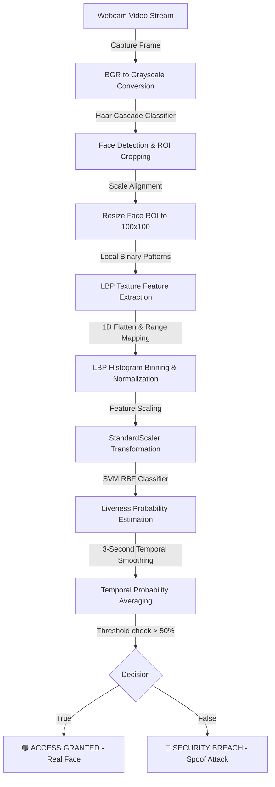

# 🛡️ Real-Time Face Liveness Detection & Biometric Anti-Spoofing System

[](https://www.python.org/)
[](https://scikit-learn.org/)
[](https://opencv.org/)
[](https://en.wikipedia.org/wiki/Biometric_anti-spoofing)

An advanced, real-time biometric security system designed to prevent spoofing attacks (facial spoof attacks via mobile screens, high-definition printouts, or paper masks). Leveraging **Local Binary Patterns (LBP)** for texture-based feature extraction and an **RBF-Kernel Support Vector Machine (SVM)**, the system performs fast, localized, and highly accurate face liveness classification right at the edge.

---

<p align="center">
  
</p>

---

## 🌟 Key Features

*   **🔒 High-Fidelity Anti-Spoofing**: Successfully detects and mitigates digital display spoofs (phones/tablets), high-resolution photo prints, and paper-mask attacks.
*   **⚡ Edge-Ready & Lightweight**: No heavy deep learning dependencies. LBP feature descriptors combined with optimized SVM classifiers run smoothly at 30+ FPS on consumer laptops and embedded devices.
*   **🎮 Cyberpunk HUD Biometric Interface**: Built-in immersive real-time testing GUI including:
    *   **Lock-on Bounding Boxes**: Smooth HUD target locking on faces.
    *   **Biometric Scan Mode**: A 3-second diagnostic phase displaying a moving laser-scan overlay.
    *   **Glassmorphism Panels**: Transparent black HUD overlays highlighting system status and real-time statistics.
    *   **Decision States**: Explicit bold visual feedback with green `ACCESS GRANTED` or red `SECURITY BREACH DETECTED`.
*   **🛠️ End-to-End Pipeline**: Includes automated Kaggle dataset download utilities, webcam-based custom dataset collectors for real/spoof classes, training pipelines, and evaluation diagnostics.

---

## 📊 System Architecture & Pipeline

The system operates on a multi-stage image processing and machine learning pipeline, running in real-time as follows:



### 🔬 Core Methodology

1.  **Face Localization**: OpenCV's Haar Cascade finds the bounding box of the face, isolating the Region of Interest (ROI) and ignoring non-biometric background noise (walls, objects, etc.).
2.  **Texture Analysis (LBP)**: Real skin reflects light smoothly and exhibits micro-pore textures. Screens suffer from *Moire patterns*, bezel borders, pixelation, and glass reflections. Printed paper exhibits unique fibrous patterns, ink dispersion, and flat light reflections. The **Local Binary Pattern (LBP)** descriptor ($Radius = 2, Points = 16$) computes a binary code for each pixel's neighborhood to identify these microscopic texture anomalies:
    $$\text{LBP}_{P, R}(x_c, y_c) = \sum_{p=0}^{P-1} s(g_p - g_c) 2^p$$
    where $g_c$ is the gray value of the center pixel, $g_p$ represents neighboring pixels, and $s(x)$ is the threshold sign function:
    $$s(x) = \begin{cases} 1 & x \ge 0 \\ 0 & x < 0 \end{cases}$$
3.  **Histogram Binning**: The extracted uniform LBP patterns are compiled into a normalized $18$-bin feature vector, serving as a lighting-invariant signature of the facial surface.
4.  **SVM Classification**: An RBF-kernel SVM maps the LBP features into a high-dimensional space where spoofing textures are highly separable from real skin:
    $$K(\mathbf{x}, \mathbf{x}') = \exp(-\gamma \|\mathbf{x} - \mathbf{x}'\|^2)$$

---

## 📂 Repository Structure

```directory
├── assets/                  # High-quality graphics and system screenshots
│   ├── banner.png           # Repository cover banner
│   ├── scan_real.png        # GUI preview during successful Access Granted state
│   └── scan_spoof.png       # GUI preview during Spoof Attack Detected state
├── dataset_tools/           # Utilities for obtaining raw training data
│   └── download_dataset.py  # Automation script to fetch and structure Kaggle liveness data
├── models/                  # Serialized binary models (ignored from Git but created locally)
│   ├── liveness_scaler.pkl  # Trained StandardScaler object
│   └── liveness_svm_model.pkl # Trained Support Vector Machine model
├── scripts/                 # Webcam collection helpers to expand the dataset
│   ├── add_custom_data.py   # Records 5,000 real and screen-spoof webcam images
│   └── add_paper_spoof.py   # Appends 3,000 paper-spoof webcam images
├── testing/                 # Evaluation and live testing environment
│   └── realtime_tester.py   # Core biometric scanner terminal (webcam GUI)
└── training/                # Machine learning training script
    └── train_model.py       # Trains model using LBP + SVM Pipeline on collected data
```

---

## ⚙️ Installation & Setup

### 1. Clone the Repository
```bash
git clone https://github.com/Ghanem-MO/Face-Anti-Spoofing.git
cd Face-Anti-Spoofing
```

### 2. Install Dependencies
Ensure you have Python 3.8+ installed, then install the required mathematical, computer vision, and machine learning libraries:
```bash
pip install opencv-python numpy scikit-image scikit-learn joblib tqdm
```

---

## 🚀 Running the System

You can run this project using pre-trained models, or build your own custom liveness classifier.

### Step A: Real-Time Verification (Immediate Test)
To launch the real-time biometric screening window immediately using the pre-packaged models (`models/` folder):
```bash
python testing/realtime_tester.py
```
*   **Idle State**: Stand in front of your camera. The system will auto-lock onto your face.
*   **Initiate Scan**: Press **`[S]`** or **`[SPACE]`** to arm the scanner.
*   **Analyze Phase**: Keep steady for **3 seconds** as the cyan laser scans your face.
*   **Result Screen**:
    *   If you are a physical human: Displays **`ACCESS GRANTED`** with your liveness probability.
    *   If you show a screen or printout: Displays **`SECURITY BREACH DETECTED`** with spoof probability.
*   **Reset**: Press **`[R]`** to clear the result and scan again.
*   **Exit**: Press **`[Q]`** to close the program.

---

<div align="center">
  <table width="100%">
    <tr>
      <td width="50%" align="center">
        <b>🟢 Access Granted (Real Face)</b><br>
        <br>
        <i>High liveness score, smooth organic skin reflections.</i>
      </td>
      <td width="50%" align="center">
        <b>🔴 Security Breach (Spoof Attack)</b><br>
        <br>
        <i>Flagged spoof screen due to pixel grids & high reflections.</i>
      </td>
    </tr>
  </table>
</div>

---

### Step B: Build/Retrain Your Own Custom Model

If you'd like to train the system to identify your own face, custom environments, or specific spoof attacks:

#### 1. Download Baseline Dataset (Optional)
To pull down a base dataset of 10,000+ real and spoof images from Kaggle:
> **Note**: Ensure you have your `kaggle.json` API token setup or let the script use the embedded configuration.
```bash
python dataset_tools/download_dataset.py
```

#### 2. Capture Custom Webcam Data (Recommended)
Tailor the model to your environment by collecting custom real and screen-spoof webcam images:
```bash
python scripts/add_custom_data.py
```
*   Press **`[R]`** to capture **5,000 frames** of your real face (rotate your head, change expressions, adjust lighting).
*   Press **`[S]`** to capture **5,000 frames** of spoof attempts (hold up a smartphone displaying photos or playing videos of your face).

#### 3. Append Paper Spoof Data
Enhance protection against printouts by capturing printed physical photos of your face:
```bash
python scripts/add_paper_spoof.py
```
*   Press **`[P]`** to capture **3,000 frames** of printed photos (bend the paper slightly, vary distances, catch reflections).

#### 4. Run Model Training
Process all raw images in `my_dataset/`, extract face ROIs, compute LBP feature vectors, and fit the RBF-Kernel SVM:
```bash
python training/train_model.py
```
Upon successful training, the script will output the classification accuracy on validation test data (typically $>98.5\%$) and overwrite `liveness_svm_model.pkl` and `liveness_scaler.pkl` in the `models/` directory.

---

## 📈 Performance & Tweaking

The system parameters are highly customizable to adapt to different lighting conditions or environments. The parameters reside in `training/train_model.py` and `testing/realtime_tester.py`:

| Parameter | Recommended Value | Purpose |
| :--- | :--- | :--- |
| `radius` | `2` | Radius around each pixel for LBP analysis. Larger values capture broader texture ranges. |
| `n_points` | `16` | Number of neighboring points sampled. Must scale with radius ($8 \times \text{radius}$). |
| `C` (SVM Parameter) | `10.0` | Regularization parameter. Balances training accuracy and boundary margin smooth-fit. |
| `minSize` | `(120, 120)` | Minimum face size for Haar Cascade detection. Prevents distant/noisy background triggers. |
| `scan duration` | `3.0` | Scanning duration in seconds. Aggregates results across frames to neutralize sudden blinks/reflections. |

---

## 🛠️ Diagnostics & Troubleshooting

*   **Camera fails to open**:
    Check that no other application is using the webcam. Modify `cap = cv2.VideoCapture(0)` to `1` or `2` in `scripts/add_custom_data.py` / `scripts/add_paper_spoof.py` / `testing/realtime_tester.py` if utilizing external webcams.
*   **Too many false positives (Spoofs classified as Real)**:
    Ensure you gather data with the actual devices (phones/tablets) you wish to prevent. Reflections and moire patterns depend heavily on device display types (AMOLED vs. LCD) and room lighting. Capturing more specific spoof data under varying light using `add_custom_data.py` will resolve this.
*   **Missing model files**:
    If the system alerts missing models, run `python training/train_model.py` to regenerate the `.pkl` files inside the `models/` folder.

---

## ⚖️ License & Contributions

Contributions, issues, and feature requests are welcome! Feel free to open a pull request or submit an issue ticket.
This project is for educational and security research purposes. Licensed under the MIT License.
